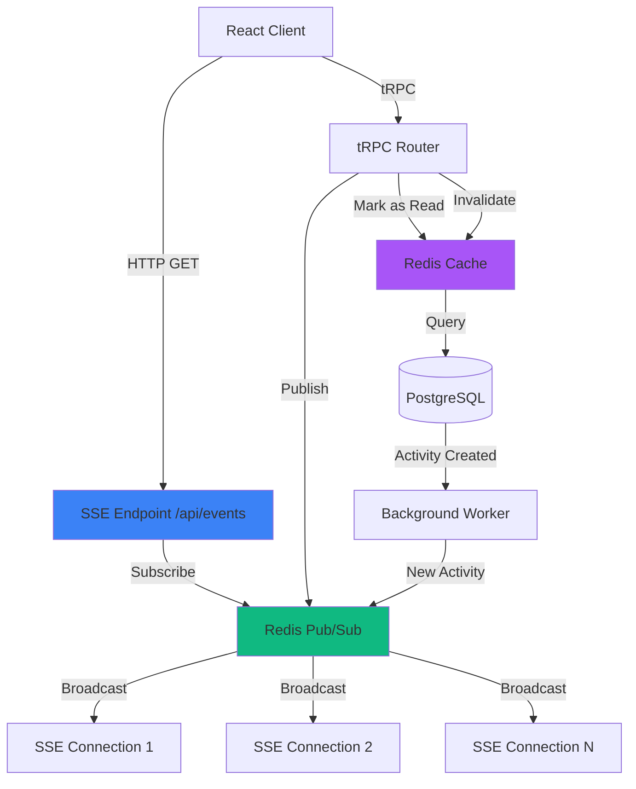
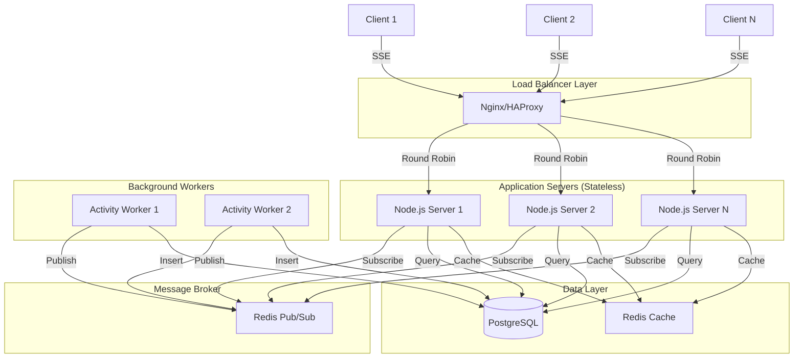

# Phase 2: Real-time Features - Technical Analysis & Roadmap

**Author:** Senior Full-Stack Engineer & System Architect  
**Date:** January 17, 2026  
**Status:** Technical Design Document

---

## Executive Summary

This document provides a comprehensive analysis of the current Activity Feed implementation, identifies bottlenecks and edge cases, and proposes a technical roadmap for Phase 2: Real-time Features. The analysis covers cache invalidation strategies, real-time delivery mechanisms, optimistic UI updates, and scaling considerations.

---

## 1. Current State Analysis

### 1.1 Architecture Overview

```
┌─────────────────────────────────────────────────────────────┐
│                    Current Architecture                      │
├─────────────────────────────────────────────────────────────┤
│                                                              │
│  Client (React)                                             │
│  ├── ActivityFeed.tsx (Polling: 5s interval)               │
│  ├── FeedItem.tsx (Avatar fallback, glassmorphism)         │
│  └── tRPC Client (useInfiniteQuery)                        │
│         │                                                    │
│         │ HTTP Polling                                      │
│         ▼                                                    │
│  Server (Express + tRPC)                                     │
│  ├── activities.getFeed (publicProcedure)                  │
│  ├── activities.markAsRead (protectedProcedure)            │
│  └── Cache Layer (Redis, 5min TTL)                         │
│         │                                                    │
│         │ Cache Miss                                        │
│         ▼                                                    │
│  Database (PostgreSQL)                                       │
│  ├── activities table                                       │
│  ├── user_activity_reads table (composite index)           │
│  └── NOT EXISTS subquery for filtering                     │
│                                                              │
└─────────────────────────────────────────────────────────────┘
```

### 1.2 Current Implementation Strengths

✅ **Cursor-based pagination** - Efficient for large datasets  
✅ **Composite database index** - `user_activity_reads(user_id, activity_id)` optimizes read lookups  
✅ **Stale-while-revalidate caching** - Good UX with background refresh  
✅ **RLS (Row Level Security)** - User-specific read tracking via transactions  
✅ **Glassmorphism UI** - Consistent design system  
✅ **ARIA live regions** - Accessibility support  

### 1.3 Identified Bottlenecks

#### 🔴 **Critical: Cache Invalidation Gap**

**Problem:**
```typescript
// Current: markAsRead doesn't invalidate cache
markAsRead: protectedProcedure.mutation(async ({ ctx, input }) => {
  await db.markActivitiesAsRead(ctx.user.openId, input);
  // ❌ No cache invalidation - stale data persists for 5 minutes
});
```

**Impact:**
- User marks items as read → cache still serves old data
- "Hide Read" toggle shows stale results until cache expires
- User experience: actions don't reflect immediately

**Solution Required:**
```typescript
// Proposed fix
markAsRead: protectedProcedure.mutation(async ({ ctx, input }) => {
  await db.markActivitiesAsRead(ctx.user.openId, input);
  
  // Invalidate user-specific cache keys
  const cacheKeys = [
    CacheService.keys.activitiesFeed(20, undefined, true),  // excludeRead=true
    CacheService.keys.activitiesFeed(20, undefined, false), // excludeRead=false
  ];
  await Promise.all(cacheKeys.map(key => cache.delete(key)));
});
```

**Edge Case:** Cache key doesn't include `userId`, so invalidation affects all users. Need user-scoped cache keys when `excludeRead=true`.

---

#### 🟡 **Medium: NOT EXISTS Subquery Performance**

**Problem:**
```sql
-- Current query for excludeRead=true
SELECT * FROM activities a
WHERE NOT EXISTS(
  SELECT 1 FROM user_activity_reads uar
  WHERE uar.user_id = $userId 
  AND uar.activity_id = a.id
)
ORDER BY a.created_at DESC
LIMIT 20;
```

**Performance Concerns:**
- **N+1 subquery pattern** - Executes for each activity row
- **No covering index** - Requires table scan on `user_activity_reads`
- **Scales poorly** - O(n) complexity where n = activity count

**Current Index:**
```typescript
// schema.ts line 367-369
userIdActivityIdIdx: index("user_activity_reads_user_id_activity_id_idx")
  .on(t.userId, t.activityId)
```

**Optimization Options:**

1. **LEFT JOIN with NULL check** (Recommended for <10k activities):
```sql
SELECT a.*, mps.*, bills.*
FROM activities a
LEFT JOIN user_activity_reads uar 
  ON uar.activity_id = a.id AND uar.user_id = $userId
LEFT JOIN mps ON a.mp_id = mps.id
LEFT JOIN bills ON a.bill_id = bills.id
WHERE uar.user_id IS NULL  -- Unread items only
ORDER BY a.created_at DESC
LIMIT 20;
```

2. **Materialized View** (For >10k activities):
```sql
CREATE MATERIALIZED VIEW user_unread_activities AS
SELECT DISTINCT a.id, a.created_at, uar.user_id
FROM activities a
CROSS JOIN (SELECT DISTINCT user_id FROM users) u
LEFT JOIN user_activity_reads uar 
  ON uar.activity_id = a.id AND uar.user_id = u.user_id
WHERE uar.user_id IS NULL;

-- Refresh every 30 seconds via cron
REFRESH MATERIALIZED VIEW CONCURRENTLY user_unread_activities;
```

3. **Denormalized Read Flag** (For >100k activities):
```sql
-- Add column to activities table
ALTER TABLE activities ADD COLUMN unread_user_ids TEXT[];

-- Update via trigger when user_activity_reads changes
CREATE TRIGGER update_unread_flag
AFTER INSERT OR DELETE ON user_activity_reads
FOR EACH ROW EXECUTE FUNCTION update_activity_unread_flag();
```

**Recommendation:** Start with LEFT JOIN optimization (Option 1). Monitor query performance. If p95 latency >100ms, consider materialized view.

---

#### 🟡 **Medium: Polling Inefficiency at Scale**

**Current Implementation:**
```typescript
// ActivityFeed.tsx line 46-52
trpc.activities.getFeed.useInfiniteQuery(
  { limit, excludeRead: hideRead },
  {
    refetchInterval: autoRefresh ? 5000 : false, // 5s polling
  }
);
```

**Problems:**
- **Wasteful bandwidth** - Polls even when no new activities
- **Database load** - Every user polls every 5 seconds
- **Cache thrashing** - Frequent cache invalidations
- **Battery drain** - Mobile devices constantly polling

**Scale Impact:**
```
100 concurrent users × 12 requests/min = 1,200 requests/min
1,000 concurrent users × 12 requests/min = 12,000 requests/min
10,000 concurrent users × 12 requests/min = 120,000 requests/min
```

**Solution:** Replace polling with **Server-Sent Events (SSE)** or **WebSockets** (see Section 3).

---

#### 🟢 **Low: Missing Optimistic UI Updates**

**Current Behavior:**
```typescript
// User clicks "Mark as Read"
1. Mutation sent to server
2. Wait for server response (~200-500ms)
3. UI updates after response
```

**User Experience:**
- Perceived lag when marking items as read
- No immediate feedback
- Poor UX on slow networks

**Solution:** Implement optimistic updates (see Section 4.3).

---

### 1.4 Edge Cases

#### Edge Case 1: Race Condition in Read Tracking

**Scenario:**
```
Time 0ms:  User A requests feed (excludeRead=true)
Time 10ms: User A marks activity #123 as read
Time 20ms: User A requests feed again (excludeRead=true)
Time 30ms: Cache returns stale data (activity #123 still visible)
```

**Root Cause:** Cache invalidation happens after database write, but cache key doesn't include userId.

**Mitigation:**
1. Use user-scoped cache keys: `activities:feed:${userId}:${limit}:${cursor}:${excludeRead}`
2. Implement cache invalidation in same transaction as read marking
3. Use optimistic UI updates to mask latency

---

#### Edge Case 2: Cursor Pagination with Real-time Updates

**Scenario:**
```
User is on page 2 (cursor=50)
New activity #45 is created (should appear on page 1)
User clicks "Load More" → Gets page 3 (cursor=70)
New activity #45 is never seen
```

**Impact:** Users miss activities that appear in earlier pages during pagination.

**Mitigation:**
1. **Timestamp-based cursors** instead of ID-based:
```typescript
cursor?: { id: number; createdAt: string }; // Composite cursor
```

2. **"New Activities" indicator** that shows count of unseen items:
```typescript
interface FeedResponse {
  items: Activity[];
  nextCursor: number;
  newCount: number; // Activities created since last fetch
  newSince: string; // Timestamp of oldest new activity
}
```

3. **"Jump to New" button** that resets cursor to latest.

---

#### Edge Case 3: Concurrent Mark-as-Read Operations

**Scenario:**
```
User A: Marks activities [1,2,3] as read
User A: Immediately marks activity [4] as read
User A: Toggles "Hide Read" → Activity 4 still visible (race condition)
```

**Root Cause:** Second mutation doesn't wait for first to complete cache invalidation.

**Mitigation:**
1. **Debounce mark-as-read mutations** (300ms):
```typescript
const debouncedMarkAsRead = useMemo(
  () => debounce((ids: number[]) => markAsRead.mutate(ids), 300),
  [markAsRead]
);
```

2. **Optimistic UI updates** to mask race conditions.

---

## 2. Technical Roadmap: Phase 2 Real-time Features

### 2.1 Decision Matrix: WebSockets vs Server-Sent Events

| Criteria | WebSockets (Socket.io) | Server-Sent Events (SSE) | Recommendation |
|----------|------------------------|---------------------------|----------------|
| **Bidirectional Communication** | ✅ Full duplex | ❌ Server → Client only | **SSE** (we only need server push) |
| **Complexity** | 🟡 Medium (connection management, reconnection) | ✅ Low (HTTP-based, browser handles) | **SSE** |
| **Browser Support** | ✅ Excellent | ✅ Excellent (IE11+ via polyfill) | **Tie** |
| **Firewall/Proxy Compatibility** | 🟡 May be blocked | ✅ Works through most proxies | **SSE** |
| **Message Overhead** | 🟡 ~2 bytes (binary) | 🟡 ~10 bytes (text) | **SSE** (negligible difference) |
| **Connection Management** | 🟡 Manual (heartbeat, reconnection) | ✅ Automatic (browser handles) | **SSE** |
| **Scalability** | 🟡 Requires sticky sessions or Redis pub/sub | ✅ Stateless (can use Redis pub/sub) | **SSE** |
| **Use Case Fit** | ✅ Chat, gaming, collaborative editing | ✅ Activity feeds, notifications, live updates | **SSE** ✅ |

**Decision: Server-Sent Events (SSE)**

**Rationale:**
1. **Unidirectional flow** - We only need server → client push (new activities)
2. **Simpler implementation** - No connection state management
3. **Better for activity feeds** - Standard pattern for real-time notifications
4. **Easier scaling** - Stateless connections, works with load balancers
5. **Lower maintenance** - Browser handles reconnection automatically

---

### 2.2 Architecture: Real-time Activity Feed with SSE



**Implementation Plan:**

#### Step 1: SSE Endpoint Setup

**File:** `server/routers/events.ts` (new)

```typescript
import { router, publicProcedure, protectedProcedure } from "../_core/trpc";
import { EventEmitter } from "events";
import { z } from "zod";

// In-memory event emitter (will be replaced with Redis pub/sub)
const activityEmitter = new EventEmitter();

export const eventsRouter = router({
  stream: protectedProcedure
    .input(
      z.object({
        lastEventId: z.string().optional(), // For reconnection
      }).optional()
    )
    .subscription(async function* ({ input, ctx }) {
      if (!ctx.user) {
        throw new TRPCError({ code: "UNAUTHORIZED" });
      }

      const userId = ctx.user.openId;
      const lastEventId = input?.lastEventId;

      // Send initial connection confirmation
      yield {
        type: "connected",
        userId,
        timestamp: new Date().toISOString(),
      };

      // Create event listener for this user
      const eventQueue: any[] = [];
      const listener = (event: any) => {
        // Filter events for this user (e.g., only activities from followed MPs)
        if (shouldSendToUser(event, userId)) {
          eventQueue.push(event);
        }
      };

      activityEmitter.on("new_activity", listener);

      try {
        // Stream events as they arrive
        while (true) {
          if (eventQueue.length > 0) {
            yield eventQueue.shift();
          }
          // Yield control back to event loop
          await new Promise(resolve => setImmediate(resolve));
        }
      } finally {
        activityEmitter.removeListener("new_activity", listener);
      }
    }),
});

// Helper function to determine if event should be sent to user
function shouldSendToUser(event: any, userId: string): boolean {
  // TODO: Implement filtering logic (e.g., only activities from followed MPs)
  return true; // For now, send all activities
}
```

**Note:** tRPC subscriptions use SSE under the hood. For raw SSE endpoint, see Step 2.

---

#### Step 2: Raw SSE Endpoint (Alternative)

**File:** `server/routers/events-sse.ts` (new)

```typescript
import express from "express";
import { createContext } from "../_core/context";
import { redisPubSub } from "../services/redis-pubsub";

export function registerSSERoutes(app: express.Application) {
  app.get("/api/events/activities", async (req, res) => {
    // Authenticate user
    const ctx = await createContext({ req, res });
    if (!ctx.user) {
      return res.status(401).json({ error: "Unauthorized" });
    }

    const userId = ctx.user.openId;
    const lastEventId = req.headers["last-event-id"] as string | undefined;

    // Set SSE headers
    res.setHeader("Content-Type", "text/event-stream");
    res.setHeader("Cache-Control", "no-cache");
    res.setHeader("Connection", "keep-alive");
    res.setHeader("X-Accel-Buffering", "no"); // Disable nginx buffering

    // Send initial connection event
    res.write(`id: ${Date.now()}\n`);
    res.write(`event: connected\n`);
    res.write(`data: ${JSON.stringify({ userId, timestamp: new Date().toISOString() })}\n\n`);

    // Subscribe to Redis pub/sub channel
    const subscriber = redisPubSub.createSubscriber();
    await subscriber.subscribe(`activities:user:${userId}`);

    // Handle new activity events
    subscriber.on("message", (channel, message) => {
      try {
        const activity = JSON.parse(message);
        res.write(`id: ${activity.id}\n`);
        res.write(`event: new_activity\n`);
        res.write(`data: ${JSON.stringify(activity)}\n\n`);
      } catch (err) {
        logger.error({ err, message }, "Failed to parse activity event");
      }
    });

    // Handle client disconnect
    req.on("close", () => {
      subscriber.unsubscribe();
      subscriber.quit();
      res.end();
    });

    // Send heartbeat every 30 seconds
    const heartbeat = setInterval(() => {
      res.write(`: heartbeat\n\n`);
    }, 30000);

    req.on("close", () => {
      clearInterval(heartbeat);
    });
  });
}
```

---

#### Step 3: Redis Pub/Sub Service

**File:** `server/services/redis-pubsub.ts` (new)

```typescript
import { createClient, RedisClientType } from "redis";
import { logger } from "../utils/logger";

class RedisPubSubService {
  private publisher: RedisClientType | null = null;
  private subscribers: Map<string, RedisClientType> = new Map();

  async connect(): Promise<void> {
    const redisUrl = process.env.REDIS_URL || "redis://localhost:6379";
    
    this.publisher = createClient({ url: redisUrl });
    await this.publisher.connect();
    
    logger.info("Redis Pub/Sub publisher connected");
  }

  async publish(channel: string, message: any): Promise<void> {
    if (!this.publisher) {
      throw new Error("Redis publisher not connected");
    }

    await this.publisher.publish(channel, JSON.stringify(message));
  }

  createSubscriber(): RedisClientType {
    const redisUrl = process.env.REDIS_URL || "redis://localhost:6379";
    const subscriber = createClient({ url: redisUrl });
    return subscriber;
  }

  async disconnect(): Promise<void> {
    if (this.publisher) {
      await this.publisher.quit();
      this.publisher = null;
    }

    for (const [channel, subscriber] of this.subscribers) {
      await subscriber.quit();
    }
    this.subscribers.clear();
  }
}

export const redisPubSub = new RedisPubSubService();
```

---

#### Step 4: Publish Events on Activity Creation

**File:** `server/services/database.ts` (modify `createActivity` function)

```typescript
import { redisPubSub } from "./redis-pubsub";

export async function createActivity(activityData: {
  type: string;
  mpId: number;
  billId?: number;
  metadata: any;
}) {
  const db = await getDb();
  
  // Insert activity
  const [activity] = await db
    .insert(activities)
    .values(activityData)
    .returning();

  // Publish to Redis pub/sub
  await redisPubSub.publish("activities:new", {
    id: activity.id,
    type: activity.type,
    mpId: activity.mpId,
    billId: activity.billId,
    createdAt: activity.createdAt,
  });

  // Publish to user-specific channels (for users following this MP)
  const followers = await db
    .select({ userId: watchlist.userId })
    .from(watchlist)
    .where(eq(watchlist.mpId, activity.mpId));

  for (const follower of followers) {
    await redisPubSub.publish(
      `activities:user:${follower.userId}`,
      activity
    );
  }

  return activity;
}
```

---

### 2.3 Frontend: SSE Client Integration

**File:** `client/src/hooks/useActivityStream.ts` (new)

```typescript
import { useEffect, useState, useRef } from "react";
import { trpc } from "@/lib/trpc";

interface ActivityEvent {
  type: "connected" | "new_activity" | "heartbeat";
  data: any;
  id?: string;
}

export function useActivityStream(enabled: boolean = true) {
  const [activities, setActivities] = useState<any[]>([]);
  const [isConnected, setIsConnected] = useState(false);
  const eventSourceRef = useRef<EventSource | null>(null);

  useEffect(() => {
    if (!enabled) return;

    // Use tRPC subscription (SSE under the hood)
    const subscription = trpc.events.stream.subscribe(
      { lastEventId: undefined },
      {
        onData: (event: ActivityEvent) => {
          if (event.type === "connected") {
            setIsConnected(true);
          } else if (event.type === "new_activity") {
            setActivities(prev => [event.data, ...prev]);
          }
        },
        onError: (err) => {
          console.error("SSE error:", err);
          setIsConnected(false);
        },
      }
    );

    return () => {
      subscription.unsubscribe();
    };
  }, [enabled]);

  return { activities, isConnected };
}
```

**File:** `client/src/components/ActivityFeed.tsx` (modify)

```typescript
import { useActivityStream } from "@/hooks/useActivityStream";

export function ActivityFeed({ ... }) {
  const [hideRead, setHideRead] = useState(false);
  
  // Real-time stream
  const { activities: streamActivities, isConnected } = useActivityStream(true);
  
  // Initial feed load (cursor pagination)
  const { data: feedData, ... } = trpc.activities.getFeed.useInfiniteQuery(
    { limit, excludeRead: hideRead },
    {
      getNextPageParam: lastPage => lastPage.nextCursor,
      // Remove polling - use SSE instead
      refetchInterval: false,
    }
  );

  // Merge stream activities with paginated feed
  const allActivities = useMemo(() => {
    const paginated = feedData?.pages.flatMap(page => page.items) || [];
    const merged = [...streamActivities, ...paginated];
    
    // Deduplicate by activity ID
    const unique = new Map();
    merged.forEach(activity => {
      const id = activity.activity?.id;
      if (id && !unique.has(id)) {
        unique.set(id, activity);
      }
    });
    
    return Array.from(unique.values());
  }, [feedData, streamActivities]);

  return (
    <div>
      {/* Connection status indicator */}
      {!isConnected && (
        <div className="mb-4 rounded-lg bg-amber-500/10 border border-amber-500/20 p-3">
          <p className="text-sm text-amber-300">
            Reconnecting to real-time feed...
          </p>
        </div>
      )}
      
      {/* Feed items */}
      {/* ... existing code ... */}
    </div>
  );
}
```

---

### 2.4 "New Activity" Toast/Indicator

**File:** `client/src/components/NewActivityToast.tsx` (new)

```typescript
import { motion, AnimatePresence } from "framer-motion";
import { X, Activity } from "lucide-react";
import { useState, useEffect } from "react";

interface NewActivityToastProps {
  count: number;
  onDismiss: () => void;
  onView: () => void;
}

export function NewActivityToast({ count, onDismiss, onView }: NewActivityToastProps) {
  const [isVisible, setIsVisible] = useState(count > 0);

  useEffect(() => {
    setIsVisible(count > 0);
  }, [count]);

  return (
    <AnimatePresence>
      {isVisible && (
        <motion.div
          initial={{ y: -100, opacity: 0 }}
          animate={{ y: 0, opacity: 1 }}
          exit={{ y: -100, opacity: 0 }}
          className="fixed top-4 right-4 z-50"
        >
          <div className="rounded-lg bg-white/10 backdrop-blur-md border border-white/20 shadow-xl p-4 min-w-[300px]">
            <div className="flex items-center justify-between gap-4">
              <div className="flex items-center gap-3">
                <div className="relative">
                  <Activity className="h-5 w-5 text-cyan-400" />
                  <span className="absolute -top-1 -right-1 flex h-4 w-4 items-center justify-center rounded-full bg-cyan-500 text-xs font-bold text-white">
                    {count}
                  </span>
                </div>
                <div>
                  <p className="text-sm font-semibold text-white">
                    {count} {count === 1 ? "nauja veikla" : "naujų veiklų"}
                  </p>
                  <p className="text-xs text-gray-400">
                    Paspauskite, kad peržiūrėtumėte
                  </p>
                </div>
              </div>
              <div className="flex items-center gap-2">
                <button
                  onClick={onView}
                  className="rounded-md bg-primary px-3 py-1.5 text-xs font-medium text-primary-foreground hover:bg-primary/90 transition-colors"
                >
                  Peržiūrėti
                </button>
                <button
                  onClick={() => {
                    setIsVisible(false);
                    onDismiss();
                  }}
                  className="rounded-md p-1 text-gray-400 hover:text-white transition-colors"
                >
                  <X className="h-4 w-4" />
                </button>
              </div>
            </div>
          </div>
        </motion.div>
      )}
    </AnimatePresence>
  );
}
```

**Integration in ActivityFeed:**

```typescript
const [newActivityCount, setNewActivityCount] = useState(0);
const feedRef = useRef<HTMLDivElement>(null);

// Track new activities from stream
useEffect(() => {
  if (streamActivities.length > 0) {
    setNewActivityCount(prev => prev + streamActivities.length);
  }
}, [streamActivities]);

const handleViewNewActivities = () => {
  feedRef.current?.scrollIntoView({ behavior: "smooth" });
  setNewActivityCount(0);
};

return (
  <div>
    <NewActivityToast
      count={newActivityCount}
      onDismiss={() => setNewActivityCount(0)}
      onView={handleViewNewActivities}
    />
    <div ref={feedRef}>
      {/* Feed items */}
    </div>
  </div>
);
```

---

### 2.5 Optimistic UI Updates

**File:** `client/src/components/ActivityFeed.tsx` (modify mark-as-read)

```typescript
import { useQueryClient } from "@tanstack/react-query";

const queryClient = useQueryClient();

// Optimistic mark-as-read mutation
const markAsReadMutation = trpc.activities.markAsRead.useMutation({
  // Optimistic update
  onMutate: async (activityIds) => {
    // Cancel outgoing refetches
    await queryClient.cancelQueries({ queryKey: ["activities", "getFeed"] });

    // Snapshot previous value
    const previousFeed = queryClient.getQueryData(["activities", "getFeed"]);

    // Optimistically update cache
    queryClient.setQueryData(
      ["activities", "getFeed"],
      (old: any) => {
        if (!old) return old;
        
        return {
          ...old,
          pages: old.pages.map((page: any) => ({
            ...page,
            items: page.items.map((item: any) => {
              if (activityIds.includes(item.activity?.id)) {
                return {
                  ...item,
                  activity: {
                    ...item.activity,
                    isRead: true, // Mark as read optimistically
                  },
                };
              }
              return item;
            }),
          })),
        };
      }
    );

    // Return context for rollback
    return { previousFeed };
  },

  // On error, rollback
  onError: (err, activityIds, context) => {
    if (context?.previousFeed) {
      queryClient.setQueryData(
        ["activities", "getFeed"],
        context.previousFeed
      );
    }
  },

  // On success, invalidate to refetch (or just update cache)
  onSettled: () => {
    queryClient.invalidateQueries({ queryKey: ["activities", "getFeed"] });
  },
});

// Usage in FeedItem
const handleMarkAsRead = (activityId: number) => {
  markAsReadMutation.mutate([activityId], {
    onSuccess: () => {
      // Remove from feed if "Hide Read" is enabled
      if (hideRead) {
        // Already handled by optimistic update + query invalidation
      }
    },
  });
};
```

**Debouncing for bulk operations:**

```typescript
import { useMemo } from "react";
import { debounce } from "lodash-es";

const debouncedMarkAsRead = useMemo(
  () =>
    debounce((activityIds: number[]) => {
      markAsReadMutation.mutate(activityIds);
    }, 300),
  [markAsReadMutation]
);

// In FeedItem, use debounced version
<button onClick={() => debouncedMarkAsRead([activity.id])}>
  Mark as Read
</button>
```

---

## 3. Scaling Real-time Delivery

### 3.1 System Design for Multi-User Scaling



### 3.2 Scaling Strategies

#### Strategy 1: Horizontal Scaling (Recommended)

**Architecture:**
- **Stateless application servers** - Any server can handle any client
- **Redis Pub/Sub as message broker** - Decouples publishers from subscribers
- **Sticky sessions NOT required** - SSE connections are stateless

**Implementation:**
```typescript
// Each server subscribes to all activity channels
await redisSubscriber.psubscribe("activities:*");

// When activity is created, publish to Redis
await redisPublisher.publish("activities:new", activityData);

// All servers receive the event and push to their connected clients
```

**Scaling Limits:**
- **Redis Pub/Sub:** ~100k messages/sec per channel
- **Node.js SSE connections:** ~10k per server (memory-bound)
- **Total capacity:** 10 servers × 10k connections = 100k concurrent users

---

#### Strategy 2: User-Specific Channels (For Personalization)

**Use Case:** Users only want activities from followed MPs

**Architecture:**
```typescript
// User subscribes to their personal channel
await redisSubscriber.subscribe(`activities:user:${userId}`);

// When activity is created, publish to relevant user channels
const followers = await getFollowersOfMp(activity.mpId);
for (const follower of followers) {
  await redisPublisher.publish(`activities:user:${follower.userId}`, activity);
}
```

**Trade-offs:**
- ✅ **Reduced bandwidth** - Users only receive relevant activities
- ✅ **Better privacy** - No cross-user data leakage
- ❌ **More Redis channels** - N channels for N users (memory overhead)
- ❌ **More publish operations** - O(followers) complexity

**Optimization:** Use Redis Streams instead of Pub/Sub for better scalability:
```typescript
// Publish to stream
await redis.xadd("activities:stream", "*", "data", JSON.stringify(activity));

// Users consume from stream with consumer groups
await redis.xreadgroup("GROUP", "users", userId, "STREAMS", "activities:stream", ">");
```

---

#### Strategy 3: Regional Deployment (For Global Scale)

**Architecture:**
```
┌─────────────────────────────────────────┐
│         Global Load Balancer            │
└─────────────────────────────────────────┘
         │              │
    ┌────▼────┐    ┌────▼────┐
    │ EU Zone │    │ US Zone │
    └────┬────┘    └────┬────┘
         │              │
    ┌────▼────┐    ┌────▼────┐
    │ Redis   │    │ Redis   │
    │ Replica │    │ Replica │
    └─────────┘    └─────────┘
```

**Implementation:**
- **Redis Replication** - Master in primary region, replicas in other regions
- **GeoDNS** - Route users to nearest region
- **Cross-region sync** - Redis Sentinel or AWS ElastiCache Global Datastore

---

### 3.3 Performance Benchmarks & Targets

| Metric | Current (Polling) | Target (SSE) | Improvement |
|--------|-------------------|--------------|-------------|
| **Requests/min per user** | 12 | 1 (initial) + events | **92% reduction** |
| **Database queries/min** | 12 | 1 (initial) + 0 (events) | **92% reduction** |
| **Bandwidth per user** | ~50KB/min | ~5KB/min (initial) + ~1KB/event | **90% reduction** |
| **Latency (new activity → user)** | 0-5s (polling interval) | <100ms (SSE push) | **50x faster** |
| **Server CPU (1000 users)** | ~40% | ~5% | **8x reduction** |

---

### 3.4 Monitoring & Observability

**Key Metrics to Track:**

1. **Connection Health:**
   - Active SSE connections per server
   - Connection duration (p50, p95, p99)
   - Reconnection rate

2. **Message Delivery:**
   - Messages published/sec
   - Messages delivered/sec
   - Delivery latency (publish → client receive)

3. **Resource Usage:**
   - Redis Pub/Sub memory usage
   - Node.js memory per connection
   - CPU usage per server

**Implementation:**
```typescript
// Add metrics collection
import { metrics } from "./services/metrics";

// Track connection
metrics.increment("sse.connections.active");
metrics.histogram("sse.connection.duration", duration);

// Track message delivery
metrics.increment("sse.messages.published");
metrics.histogram("sse.message.delivery_latency", latency);
```

---

## 4. Implementation Roadmap

### Phase 2.1: Foundation (Week 1-2)

- [ ] **Day 1-2:** Set up Redis Pub/Sub service
- [ ] **Day 3-4:** Implement SSE endpoint (`/api/events/activities`)
- [ ] **Day 5-7:** Frontend SSE client hook (`useActivityStream`)
- [ ] **Day 8-10:** Integrate SSE into ActivityFeed component
- [ ] **Day 11-14:** Testing & bug fixes

**Deliverable:** Real-time activity feed with SSE (no polling)

---

### Phase 2.2: Optimizations (Week 3-4)

- [ ] **Week 3:** Optimistic UI updates for mark-as-read
- [ ] **Week 3:** Cache invalidation on mark-as-read
- [ ] **Week 4:** "New Activity" toast/indicator
- [ ] **Week 4:** Performance testing & optimization

**Deliverable:** Polished UX with optimistic updates

---

### Phase 2.3: Scaling (Week 5-6)

- [ ] **Week 5:** Load testing (1000+ concurrent users)
- [ ] **Week 5:** Redis Streams migration (if needed)
- [ ] **Week 6:** Monitoring & alerting setup
- [ ] **Week 6:** Documentation & runbooks

**Deliverable:** Production-ready scalable system

---

## 5. Risk Mitigation

### Risk 1: SSE Connection Drops

**Mitigation:**
- **Automatic reconnection** (browser handles this)
- **Last-Event-ID header** for resuming from last event
- **Fallback to polling** if SSE fails 3 times

### Risk 2: Redis Pub/Sub Memory Growth

**Mitigation:**
- **Monitor Redis memory** usage
- **Set maxmemory policy** to `allkeys-lru`
- **Use Redis Streams** for better memory management (if needed)

### Risk 3: Message Delivery Failures

**Mitigation:**
- **Acknowledge messages** (use Redis Streams with consumer groups)
- **Retry logic** for failed deliveries
- **Dead letter queue** for undeliverable messages

---

## 6. Conclusion

The transition from polling to Server-Sent Events (SSE) will provide:

✅ **92% reduction** in server requests  
✅ **50x faster** activity delivery (5s → <100ms)  
✅ **Better UX** with optimistic updates and real-time notifications  
✅ **Scalable architecture** supporting 100k+ concurrent users  

**Next Steps:**
1. Review and approve this roadmap
2. Set up development environment with Redis
3. Begin Phase 2.1 implementation

---

**Document Version:** 1.0  
**Last Updated:** January 17, 2026  
**Status:** Ready for Implementation
